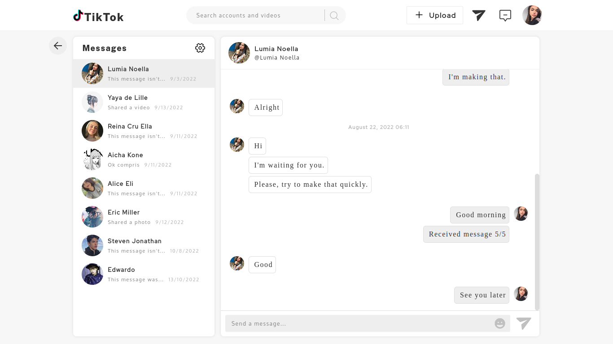
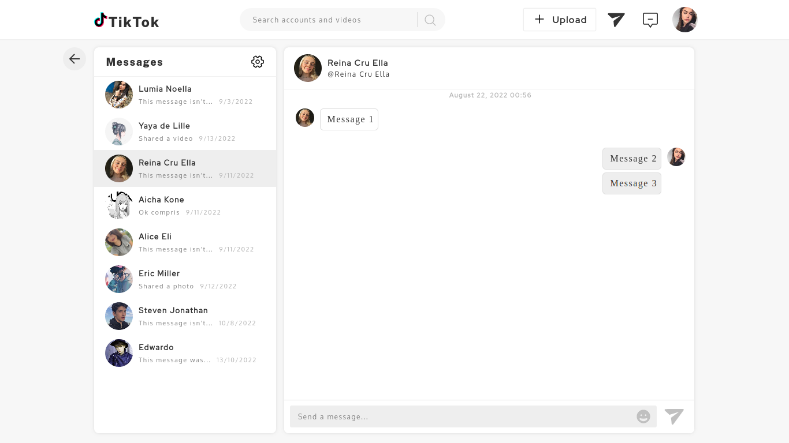
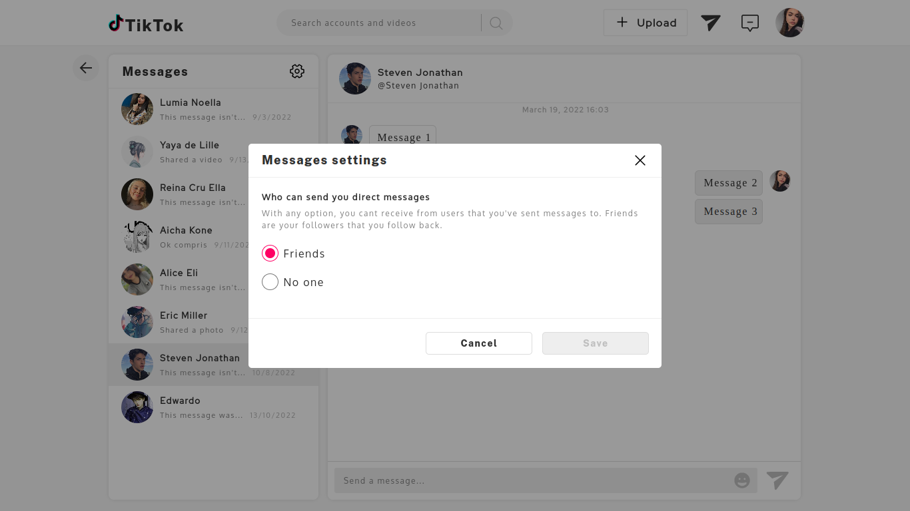
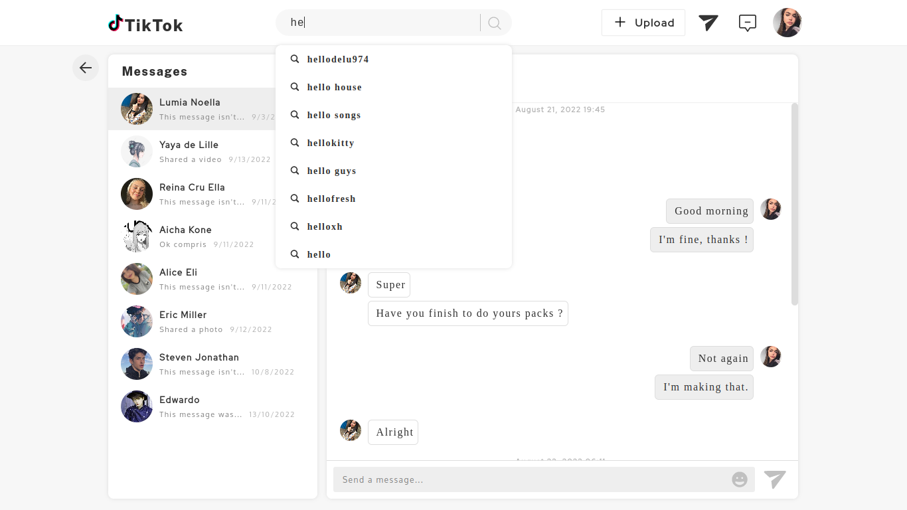

# TikTok Chat Simulation


This project is an academy project. This's made to evaluate React framework performances and get more knowledge about how class components work. It's front-end only. No any back-end API is called. The main goal of this project is to reproduce TitkTok chat section using native web language on pages's style sheets.

## Final result
This is the final result of the project:<br/><br/>





## Project installation
### <u>Install curl</u>:
```sh
sudo apt install curl
```

### <u>Install nodejs</u>:
```sh
cd ~
curl -sL https://deb.nodesource.com/setup_16.x -o /tmp/nodesource_setup.sh
```
```sh
sudo bash /tmp/nodesource_setup.sh
```
```sh
sudo apt install nodejs
```
```sh
node -v
```

### <u>Install yarn with npm</u>:
NPM (Node Package Manager) is the default program that is automatically installed on Nodejs installation. You can use NPM directly when Nodejs is already installed.
```sh
sudo npm install yarn --global
```

### <u>React installation</u>:
If you don't have React in your computer, you can install it with npm or yarn like this:
```sh
sudo yarn global add create-react-app
```

### <u>Project cloning</u>:
```sh
git clone git@github.com:obrymec/TikTok-Chat-Simulation.git titktok-chat-simulation/
```

### <u>Install project dependencies</u>:
Go to the root folder of the project and run:
```sh
yarn install
```

### <u>Run project</u>:
Go to the root folder of the project and run:
```sh
yarn start
```

Go to your favorite browser and tap on the search bar the following link:
```sh
http://localhost:3000/
```

Enjoy :)
